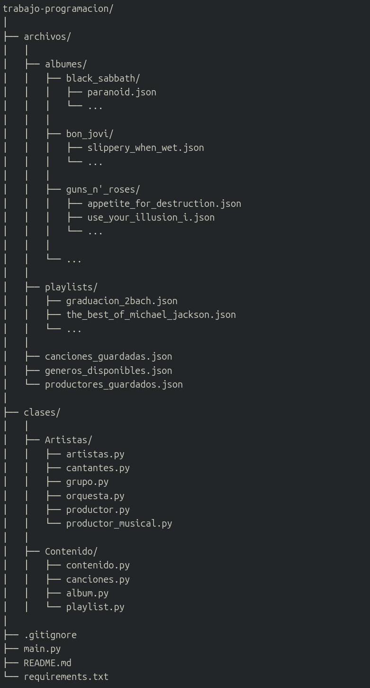
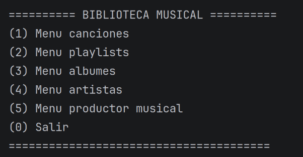
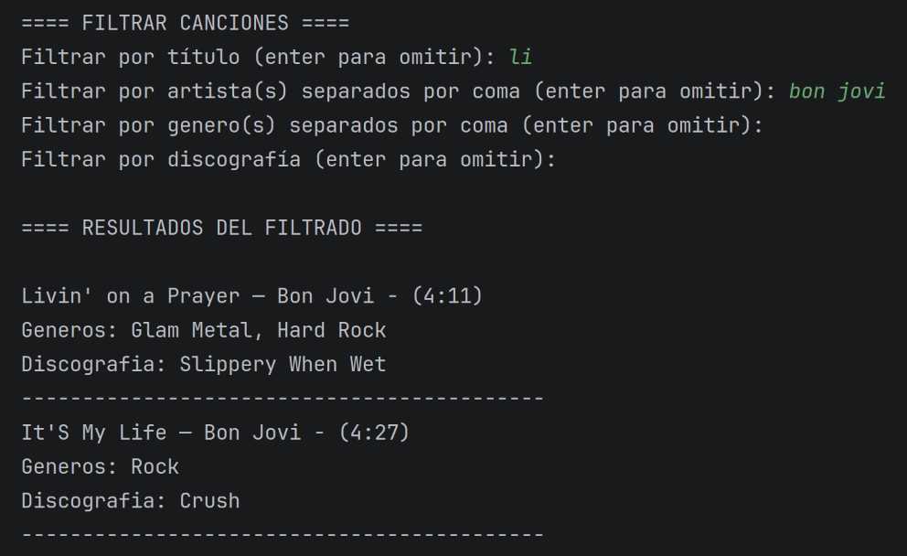
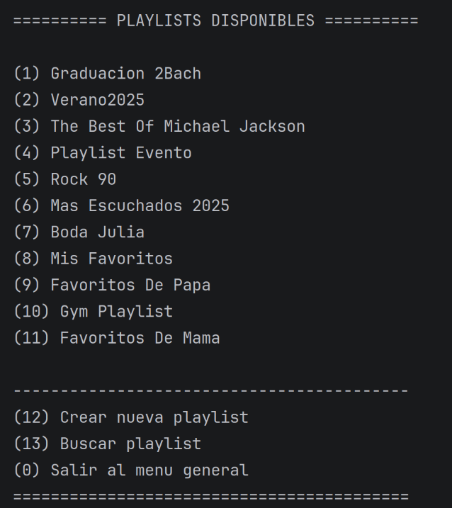
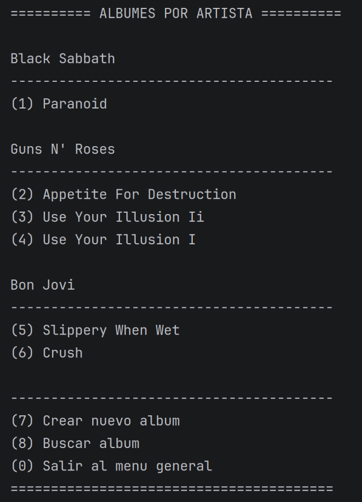

# BIBLIOTECA MUSICAL

---
### Kacper Piklowski y Tegra Vuvu

---
**Idea principal:**

La idea principal de este programa es ofrecer una gestion sencilla del contenido musical (canciones, playlists, artistas...), incluyendo posibilidad de guardar informacion (con archivos `.json`) sobre los _grupos/artistas_, y todo esto controlado por una funcion logica con bucles. 

---

\
**El programa contiene:**
1. **Archivo `main.py`**: contiene la parte fundamental del proyecto, es decir el menu controlado por los bucles y condicionales con todos los metodos creados en las clases ya implementado. El `main.py` esta completamente preparado para su correcto funcionamiento. 

2. **Carpeta `Archivos`**: esta carpeta contiene todos los archivos que vamos a utilizar para montar el programa. Destacamos:
- **Carpeta `albumes`**: contendra albumes que se van a crear\guardar. 
- **Carpeta `playlists`**: la misma logica que con albumes. Se podran crear y modificar playlists.
- **Carpeta `artistas_guardados`**: una carpeta que dentro contiene archivos `.json` donde vamos a guardar los grupos, cantantes...
- **Archivos `canciones_guardadas` y `generos_disponibles`**: sirven para guardar las canciones y los generos disponibles, respectivamente. 

3. **Carpeta `clases`**: esta carpeta contiene el contenido importante que aprendemos en esta asignatura. Dividimos las clases en varias carpetas:
- `Atristas`: contiene un archivo principal `artistas` y otros archivos que **heredan** de la clase principal. Es una **clase abstracta** 
- Del mismo modo tenemos la carpeta `Contenido` que contiene las clases que nos serviran para gestinar el contenido musical (canciones, albumes...).
---
**Guia del proyecto**
A continuacion se muestra un esquema conceptual de la logica de los archivos y las carpetas.

---
**Guia de funcionamiento:**
1) Una vez abierto el repositorio y leido este documento, para ejecutar el programa, **abrir el archivo ejecutable `main.py`**.
2) Al ejecutar este archivo, aparecera un menu general con todas las posibles opciones de manejo de la biblioteca musical que ofrece nuestro programa. Entre se puede encontrar:

\

   - _**Menu de canciones**_ (pemite todo el menejo basico de las canciones):
     - Se podra **guardar la cancion** en la base de datos (archivo `.json`), introduciendo todos los datos que se pide.
     - **Eliminar la cancion** de la base de datos introduciendo el titulo de la cancion y el autor (ademas confirmando la eliminacion).
     - **Buscar la cancion** en la base de datos, introducir titulo y el artista. Se devuleve toda la informacion guardada de la cancion encontrada. 
     - **Filtrar las canciones** en toda la base de datos. Consiste en ir introduciendo (o no) algunos datos que se piden y el programa devolvera todas las canciones relacionadas con los datos intorducidos. Por ejemplo:

   \
          
            
                

Puesto que una parte de titulo coincide en las dos canciones, y el artista coincide, resultado seran estas dos canciones. 

- _**Menu playlist:**_ (Permite el manejo de las playlists.)
En las playlists trabajamos de manera que cada playlist es un archivo `.json` diferente, y las almacenamos en una carpeta.
  - Al abrir el menu se mostraran todas las playlists disponibles numeradas para facilitar la eleccion de una.
  - Usamos un **contador dinamico** que permite agregar tantas playlists cuantas sean necesarias, y la opcion de crear nueva playlist y buscar playlist, siempre mantenerlas aparte. 
  - **Crear nueva playlist** es muy intuitivo, se piden datos de la playlist al usuario y se crea una playlist vacia, preparada para anadirle canciones. 
  - **Buscar playlist**. Para facilitar el control de las playlist en caso de que haya muchas ofrecemos la opcion de buscar la playlist:
    - en caso de enocntrarla se pregunta si se desea editarla o no.
    - en caso de no encontrarla se muestra un mensaje correspondiente y se vuelve al menu de todas las playlists.
  - _**Menu playlist (dentro)**_ (permite control de la playlist elegida.)
    - Permite operaciones como mostrar informacion, anadir/eliminar canciones y eliminar playlist.

\

  - _**Menu Artista**_ (pemite control de los artistas guardados.)
       - Nuestro programa ofrece anadir/eliminar artista, buscar artista, mostrar un listado de todos los artistas guardados. 
  - _**Menu Album**_ (menu permite controlar los albumes de cada artista.)
    - Para realizar este menu organizamos los albumes de la sigunete forma:
      - Cada artista tiene su propria carpeta con su nombre, si la carpeta no existe, se crea automaticamente al anadir nuevo album para un artista. Si ya existe, simplemente se anade el album a la carpeta correspondiente. 
    - Para este menu tambien utilizamos el **contador dinamico** con el mismo objetivo que en el caso de las playlists. 
    - Opciones de buscar y crear album nuevo siguen la misma logica que las playlists, anadiendo la necesidad de introducir el artista.
    - El menu de albumes es muy intuitivo y seguro que no habra problema con entender su funcionamiento.
     
\

     

   - _**Menu Album (dentro)**_ (permite manejar el album una vez elegido uno.)
     - Dentro del menu se puede mostrar toda la informacion del album, listado de canciones, eliminar album y anadir/eliminar canciones.
   - _**Menu Productor**_ (permite manejar los productores musicales.)
     - En el ultimo menu se puede anadir nuevo productor a la base de datos, eliminar uno, buscar y mostrar todos productores.
3) Una vez navegado por el programa y acabado la prueba, para salir (tanto del programa, como de los submenus al menu general) simplemente es suficiente presionar el boton `0` en el teclado. 

---
A lo largo de la practica hemos intentado introducir todo lo que hemos visto en clases. Manejamos los archivos `.json` para guardar la informacion. Hasta ahora hemos implementado la mayoria del contenido visto en clase (falta introducir los archivos binarios `pickle`, pero finalmente sera implementado.)

---

---

